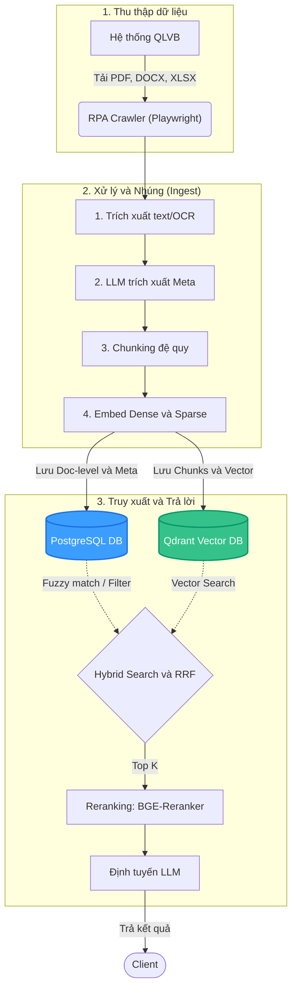
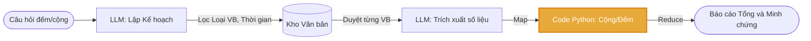

# DocNexus (QLVB AI v3) - Sở Khoa học và Công nghệ

DocNexus là hệ thống trợ lý AI chuyên biệt dành cho nghiệp vụ quản lý, tra cứu và xử lý văn bản hành chính, được phát triển phục vụ Sở Khoa học và Công nghệ. Hệ thống kết hợp các công nghệ truy xuất thông tin hiện đại (RAG, Hybrid Search) và tự động hóa quy trình (RPA) để tối ưu hóa công tác văn thư và thẩm định dự thảo.

## 🏛 Kiến trúc Hệ thống (Architecture)

Sơ đồ tổng quan về luồng dữ liệu (Data Flow) và xử lý truy vấn:

Hệ thống được thiết kế theo kiến trúc Micro-services thu nhỏ, phân tách rõ ràng giữa lớp thu thập dữ liệu, lưu trữ, xử lý AI và giao diện người dùng:

1. **Data Ingestion & RPA Pipeline:** Sử dụng Playwright để tự động cào dữ liệu (Văn bản đi/đến), vượt qua SSO. Dữ liệu tải về qua bộ lọc 4 lớp và được trích xuất nội dung đa định dạng.
2. **Metadata & Chunking:** LLM cấu hình nhẹ đóng vai trò bóc tách metadata. Văn bản được chia chunk đệ quy để bảo toàn cấu trúc ngữ nghĩa (Điều, Khoản).
3. **Dual Storage (Lưu trữ kép):** Postgres đóng vai trò *System of Record*, Qdrant lưu trữ vector để tìm kiếm.
4. **Retrieval & RAG Pipeline:** Áp dụng Hybrid Search cùng thuật toán RRF. Kết quả sau đó được chấm điểm và sắp xếp lại bằng Cross-Encoder (Reranker).
5. **Presentation Layer:** Giao diện Web tối giản, tốc độ cao (FastAPI + Jinja2).

## 🛠 Công nghệ sử dụng (Tech Stack)
- **Backend & Core:** FastAPI, Uvicorn, Python 3.
- **Database:** PostgreSQL (`pg_trgm`), Qdrant.
- **AI & Machine Learning:** `BAAI/bge-m3`, `BAAI/bge-reranker-v2-m3`, OpenRouter/Gemini API.
- **Data Extraction:** `PyMuPDF`, `python-docx`, `pandas`, `pytesseract`, `pdf2image`, LibreOffice.
- **RPA & Crawler:** Playwright (async).
- **Frontend:** HTML5, CSS3, Vanilla JS, SweetAlert2.

## ✨ Các tính năng nổi bật (Key Features)

### 1. Tra cứu văn bản thông minh (Hybrid Search + RAG)
Tìm kiếm nội dung văn bản bằng ngôn ngữ tự nhiên. Trợ lý AI đọc các đoạn văn bản liên quan và tổng hợp câu trả lời, bắt buộc trích dẫn nguồn minh chứng.

### 2. Tổng hợp số liệu đa văn bản (Map-Reduce)
Khắc phục nhược điểm "ảo giác toán học" của LLM bằng luồng Map-Reduce chuyên biệt:

### 3. Kiểm tra, thẩm định dự thảo (Draft Checking)
- **Kiểm tra thể thức:** Rà soát các lỗi định dạng (font, lề, cỡ chữ) tự động bằng code Python dựa trên NĐ 30/2020/NĐ-CP.
- **Kiểm tra nội dung:** Phát hiện lỗi logic, chính tả và kiểm tra chéo (cross-check) tính hợp lệ của các căn cứ pháp lý.

### 4. Tự động hóa cào dữ liệu (Auto-Crawler) & Admin Dashboard
Cào tự động văn bản Đi/Đến, tự động mở cửa sổ xử lý Captcha và giám sát các luồng tải ngay trên Dashboard thời gian thực.